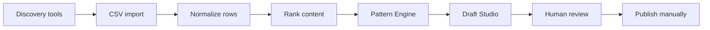

# AGLI Architecture

## Design Choice

The prototype is a static React app because the client needs low cost, speed, and non-technical usability. Platform data access is uneven, so the most credible MVP is an import-first workflow rather than fragile scraping.

## Data Flow

## Modules

- `data/content.csv`: optional local research dataset for reproducible reports.
- `src/lib/csv.ts`: CSV parser and imported row normalization.
- `src/lib/scoring.ts`: ranking and pattern grouping logic.
- `src/lib/drafts.ts`: deterministic draft generation with guardrails.
- `scripts/analyze-content.mjs`: reproducible offline pattern report.

## Why No Live Scraping

LinkedIn, Instagram, and TikTok restrict reliable public metric access. A live scraper would be brittle, slow in live walkthroughs, and risky for terms of service. AGLI instead accepts verified exports from platform-native analytics and discovery tools.

## Future API Upgrade

The static prototype can be extended with:

- YouTube Data API for video search and metrics.
- OpenAI or Claude API for stronger draft generation.
- Supabase or Neon for storing research runs.
- Scheduled worker to refresh saved queries.
